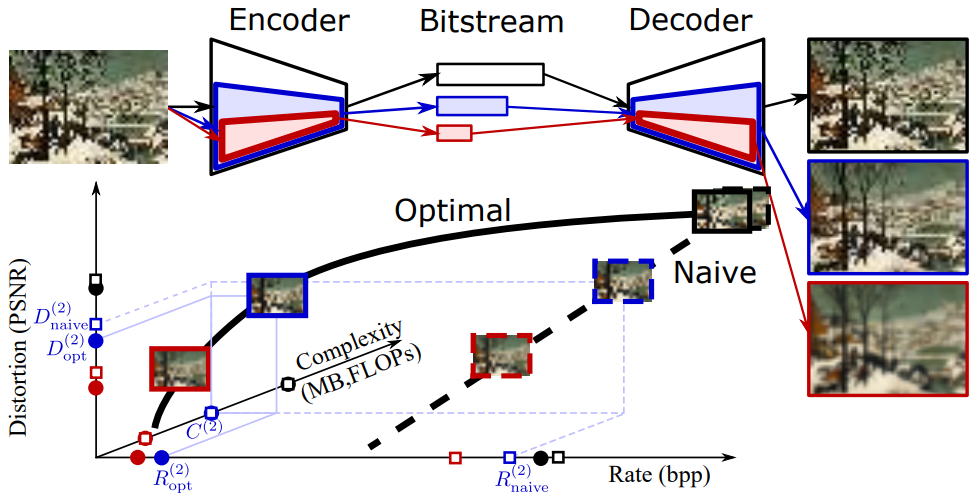

# Slimmable Compressive Autoencoders for Practical Neural Image Compression
### [[paper]](https://arxiv.org/abs/2103.15726)

# Abstract: 
Neural image compression leverages deep neural networks to outperform traditional image codecs in ratedistortion performance. However, the resulting models are also heavy, computationally demanding and generally optimized for a single rate, limiting their practical use. Focusing on practical image compression, we propose slimmable compressive autoencoders (SlimCAEs), where rate (R) and distortion (D) are jointly optimized for different capacities. Once trained, encoders and decoders can be executed at different capacities, leading to different rates and complexities. We show that a successful implementation of SlimCAEs requires suitable capacity-specific RD tradeoffs. Our experiments show that SlimCAEs are highly flexible models that provide excellent rate-distortion performance, variable rate, and dynamic adjustment of memory, computational cost and latency, thus addressing the main requirements of practical image compression.
 

# The main dependency 
- **Data Compression Library:** (https://github.com/tensorflow/compression), thanks to Johannes Ballé, Sung Jin Hwang, and Nick Johnston

# Installation 
- Install compression library with version 1.1 (https://github.com/tensorflow/compression/releases/tag/v1.1).
(In our paper we use the version 1.1 for our MAE method without hyperprior and version 1.2 with hyperprior and autoregressive.)
- Add the slimmable convolutional layer './tensorflow_compression/signal_conv_slim.py' and the slimmable GDN layer './tensorflow_compression/gdn_slim_plus.py' into the compression library.

# Train a SlimCAE with a set of predefined RD tradeoffs for different widths   
python SlimCAE.py -v --train_glob='/path_to_training_dataset/*.png' --patchsize 240 --num_filter 192 --switch_list 192 144 96 72 48 --train_jointly --lambda 2048 1024 512 256 128 --last_step 1000000 --checkpoint_dir /path_for_saving_the_model train

# Evaluate a pretrained model
python SlimCAE.py --num_filter 192 --switch_list 192 144 96 72 48 --checkpoint_dir /path_of_the_pretrain_model --inputPath /path_of_test_dataset/ --evaluation_name /path_for_saving_results evaluate

# Train a SlimCAE with lambda-scheduling
python SlimCAE.py -v --train_glob='/path_to_training_dataset/*.png' --patchsize 240 --num_filter 192 --switch_list 192 144 96 72 48 --train_jointly --lambda 4000 4000 4000 4000 4000 --last_step 1000000 --checkpoint_dir /path_for_saving_the_model --inputPath /path_of_validation_dataset --evaluation_name /path_for_saving_the_results_on_validation_dataset train_lambda_schedule

# Main references 
Our work heavily relys on the following projects: 
- \[1\] 'Lossy Image Compression with Compressive Autoencoders' by Theis et. al, https://arxiv.org/abs/1703.00395
- \[2\] 'Variable Rate Deep Image Compression With Modulated Autoencoder' by Fei et. al, https://ieeexplore.ieee.org/document/8977394
- \[3\] 'End-to-end Optimized Image Compression' by Ballé et. al, https://arxiv.org/abs/1611.01704
- \[4\] 'Variational image compression with a scale hyperprior' by Ballé et. al, https://arxiv.org/abs/1802.01436
 
It would be helpful to understand this project if you are familiar with the above projects.
